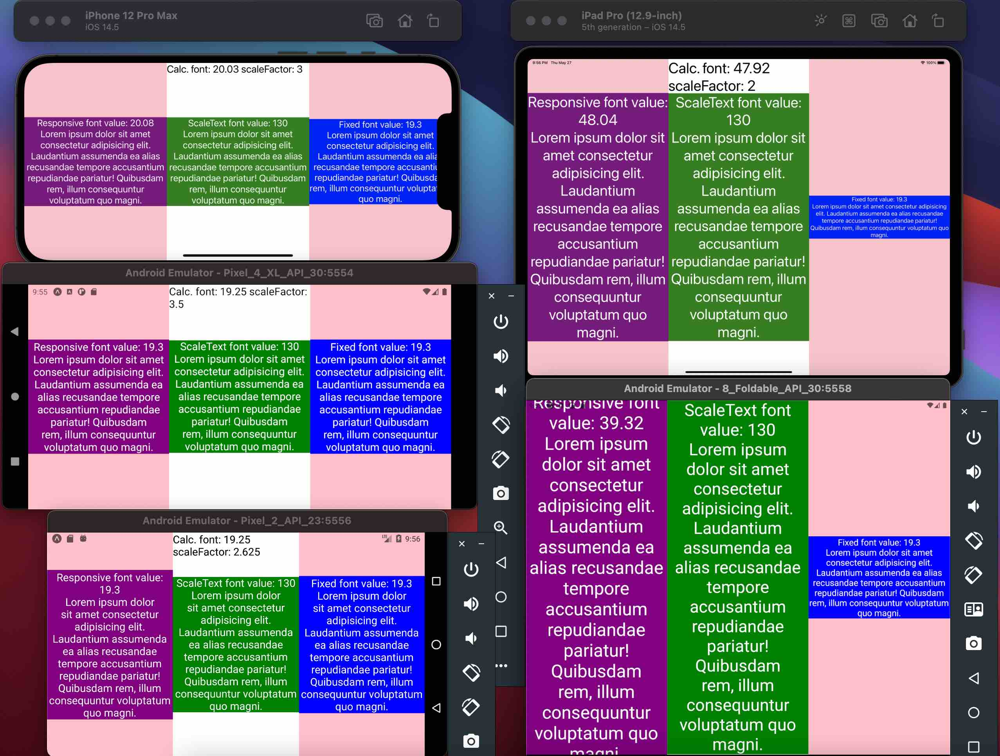

# react-native-scale-text
Scale-text is a component that allows you to keep the display of your texts consistent and independent of the device's display context.<br/>
It's a full typescript component that uses a View wrapper with onLayout state to compute the font of the text relatively.<br/>
The work is still in progress but you can use it and improve it if you want! PR are welcome.

[NPM package](https://www.npmjs.com/package/@grean/react-native-scale-text)

## Compare responsiveScreenFontSize formula VS ScaleText component VS RN value (24) 
# Portrait

# Landscape


## Installation
Using yarn:

```sh
yarn add @grean/react-native-scale-text
```

## Usage
Simply use <ScaleText> Component almost like RN <Text> component.

```tsx
const isLandscape = false
const fontSize = isLandscape ? 130 : 72
const yourText = `Lorem ... magni.`

//removed code for brevety

<ScaleText
  {...{
    allowFontScaling: false,
    debug: true,
    fontSize,
    onPress: () => (alert('ScaleText clicked!')),
    textStyle: {
      backgroundColor: 'green'
    }
  }}
>
  {yourText}
</ScaleText>
```

## Component props
```tsx
interface ScaleTextProps {
  allowFontScaling?: boolean // false
  children: React.ReactNode // 'your text here'
  containerStyle?: {
    // * <View> style props
    // default running values that you can override:
    flex: 1,
    justifyContent: 'center',
  }
  fontSize: number // 80
  padding?: string // '0%'
  onPress?: () => void
  textStyle?: {
    // * <Text> style prop EXCEPT fontSize.
    // default running values that you can override:
    textAlign: 'center',
    color: '#fff',
    includeFontPadding: false,
  }
  debug?: boolean // false
}
```

## Testing
See Expo example app for testing with hot-reload.
```sh
git clone https://github.com/grean/react-native-scale-text.git
cd react-native-scale-text && yarn
cd example && yarn && yarn ios
```

## About
If you want to eat well and healthy, i recommand you to check out my mobile app [Dietethic.net](https://dietethic.net)<br/>
<a align="center" href="https://github.com/grean?tab=followers">
  
</a>
<br />
<a align="center" href="https://twitter.com/reanGuillaume">
  
</a>

## License 
MIT
